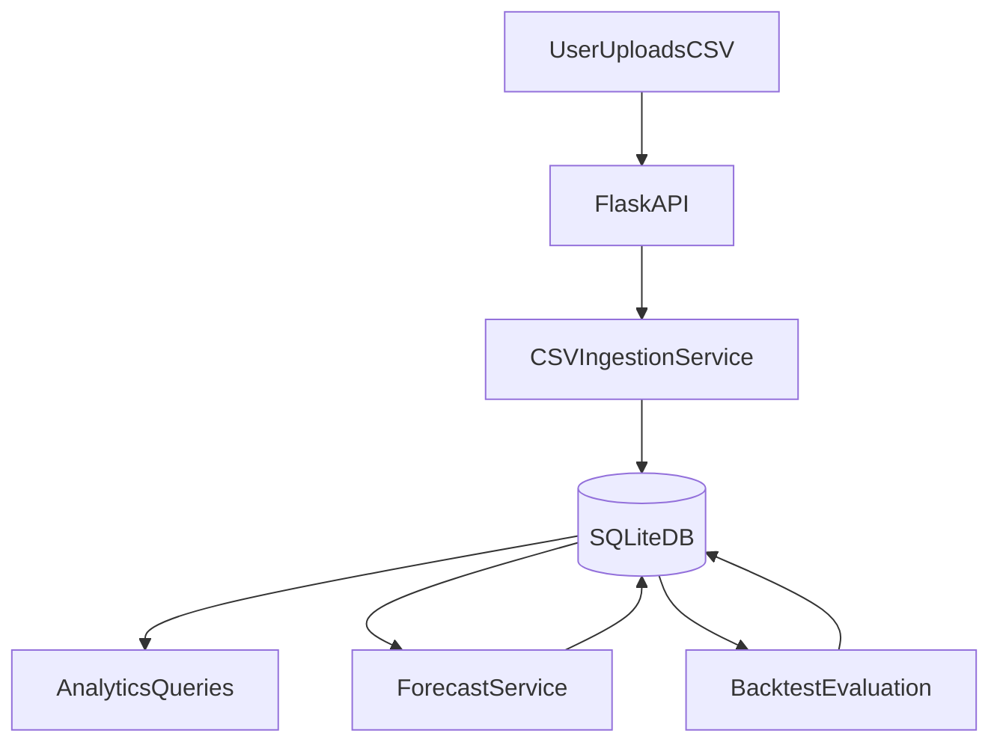

# Backend overhaul (Flask + SQLite)

## What we have today (baseline)

- **Backend code**: single file Flask app in [`pinkcafe/Backend/app.py`](/home/shamy/systems-development-group-project/pinkcafe/Backend/app.py).
  - Endpoints: `POST /api/login`, `POST /api/register`, `GET /api/sales`, `GET /api/sales/summary`.
  - DB: in-repo SQLite file `pinkcafe/Backend/pinkcafe.db`.
  - Auth: SHA256 hashing (`hash_password`) (not suitable for production).
- **Data scripts**: `pinkcafe/backend/csv_import.py` (local CLI importer into the normalized schema) and `pinkcafe/backend/Prophet.py` (standalone Prophet batch script; not wired into the API).
- **CSV reality** (important):
  - Coffee CSV (canonical): [`pinkcafe/backend/CSV_Files/Pink CoffeeSales March - Oct 2025.csv`](/home/shamy/systems-development-group-project/pinkcafe/backend/CSV_Files/Pink%20CoffeeSales%20March%20-%20Oct%202025.csv) with header `Date,Cappuccino,Americano`.
  - Food CSV example: [`pinkcafe/backend/CSV_Files/Pink CroissantSales March - Oct 2025.csv`](/home/shamy/systems-development-group-project/pinkcafe/backend/CSV_Files/Pink%20CroissantSales%20March%20-%20Oct%202025.csv) with `Date,Number Sold` (single item).
- **Scope decisions you made**:
  - Keep **Flask + SQLite**.
  - Data is **wide-column CSVs**.
  - For MVP, treat data as **single café only** (no per-café dimension yet).

## Goal of the overhaul (backend-only deliverables)

Implement backend capabilities to support:

- CSV ingestion (upload or server-side import) into a normalized DB.
- Identify **top 3 foods** + **top 3 coffees**, and show **4-week fluctuations**.
- Forecast sales for selected products **4 weeks ahead**, with:
  - **Training window** selectable **4–8 weeks**.
  - **Zoom** into a selected forecast period (subset of days).
  - Output in **tabular JSON** and optionally **graph-ready** series; optionally return **PNG charts**.
- Optional **model evaluation** view: compare algorithms and show accuracy metrics.
- Quality control: documented test plan, invalid-input testing, stress testing, and CI gating for PRs into `main`.

## Proposed backend architecture

### 1) Restructure into a real Python package

Convert `pinkcafe/Backend/` into a package-like layout (still Flask):

- `backend/app.py` (app factory + route registration)
- `backend/config.py` (env-driven config: DB path, CORS, secrets)
- `backend/db.py` (SQLite connection + migrations)
- `backend/models/` (DB schema helpers)
- `backend/services/`
  - `csv_ingest.py` (parsers/validators)
  - `analytics.py` (top sellers, 4-week windows)
  - `forecasting.py` (Prophet + baselines)
  - `evaluation.py` (backtesting + metrics)
- `backend/routes/` (`auth.py`, `sales.py`, `forecast.py`, `evaluation.py`)
- `backend/tests/` (pytest)

**Note:** right now Docker files reference `pinkcafe/backend` (lowercase) in [`docker-compose.yml`](/home/shamy/systems-development-group-project/docker-compose.yml) and [`Dockerfile.backend`](/home/shamy/systems-development-group-project/Dockerfile.backend), but the repo contains `pinkcafe/Backend` (uppercase). On Linux this mismatch breaks volume mounts/builds; the overhaul should normalize the folder naming.

### 2) Database schema (SQLite) to support the requirements

Move from the current fixed `coffee_sales(date,cappuccino,americano)` to a normalized schema:

- `users(id, username, email, password_hash, created_at)`
- `datasets(id, name, uploaded_at, source_filename, notes)`
- `items(id, name, category)` where `category ∈ {coffee, food}`
- `sales(id, dataset_id, date, item_id, quantity)`
- `model_runs(id, dataset_id, item_id, algorithm, train_start, train_end, horizon_days, created_at, params_json)`
- `forecasts(id, model_run_id, date, yhat, yhat_lower, yhat_upper)`
- `evaluation_runs(id, dataset_id, algorithm, created_at, params_json)`
- `evaluation_metrics(id, evaluation_run_id, item_id, metric_name, metric_value)`

This schema makes “top 3” and “multi-item forecasts” straightforward, and makes evaluation repeatable.

### 3) CSV ingestion that handles your two coffee formats

Create a robust ingestion layer that:

- Accepts **wide CSVs** with `Date` + item columns (`Cappuccino`, `Americano`, …).
- Also handles the **2-row header** variant by detecting and normalizing it.
- Validates:
  - date parsing (`DD/MM/YYYY`)
  - non-negative integer quantities
  - missing columns
- Persists raw upload metadata in `datasets`, and writes rows into `sales`.

### 4) API surface (v1)

Keep existing endpoints but add the required ones, with consistent JSON and error handling.

**Auth (minimal, still useful for later):**

- `POST /api/v1/auth/register`
- `POST /api/v1/auth/login`

**Ingestion:**

- `POST /api/v1/datasets` (upload CSV + dataset name)
- `POST /api/v1/datasets/{id}/ingest` (run ingestion if upload is stored)
- `GET /api/v1/datasets` (list)

**Analytics (4-week window):**

- `GET /api/v1/analytics/top-sellers?category=coffee|food&weeks=4&dataset_id=...`
- `GET /api/v1/analytics/fluctuation?item_id=...&weeks=4&dataset_id=...`

**Forecasting (4-week horizon, train window 4–8 weeks):**

- `GET /api/v1/forecast?item_id=...&train_weeks=4..8&horizon_weeks=4&dataset_id=...`
- `GET /api/v1/forecast/zoom?...&start=YYYY-MM-DD&end=YYYY-MM-DD`
- Optional: `GET /api/v1/forecast/plot?...` (returns PNG)

**Evaluation (optional dashboard tab):**

- `POST /api/v1/evaluation/run` (choose algorithms, items, backtest params)
- `GET /api/v1/evaluation/results?run_id=...` (metrics + per-item breakdown)

### 5) Algorithms + evaluation approach (meets “experiment with algorithms”)

Implement an algorithm interface and ship at least two algorithms:

- **Prophet** (already in requirements; integrate properly)
- **Baseline** (e.g., SeasonalNaive or MovingAverage) for comparison

Evaluation/backtesting (simple, defensible):

- For each item: take the most recent `k` days as holdout (e.g., 14 or 28), train on the selected training window before it, forecast holdout, compute MAE/RMSE/MAPE.
- Store runs + metrics in DB so the optional dashboard can query them.

### 6) Quality, security, and DX upgrades

- Replace SHA256 password hashing with **bcrypt/argon2**.
- Add request validation (manual or lightweight schema validation) and consistent error payloads.
- Centralize config via env vars (`DATABASE_PATH`, `CORS_ORIGINS`, `SECRET_KEY`).
- Add **pytest** tests for:
  - CSV parsing (both coffee formats + croissant format)
  - Analytics queries
  - Forecast endpoint returns deterministic shape
- Add minimal OpenAPI-like documentation in a `README` for endpoints.

## Quality control, testing, and CI (added requirements)

### 1) Testing plan (what we will test and why)

We’ll create a short, explicit testing plan document (backend-only) that covers:
- **Invalid input testing** (defensive API behavior):
  - Missing/invalid JSON bodies
  - Wrong types (strings where ints expected; negative quantities)
  - Bad dates and mixed date formats
  - Empty CSVs, missing headers, duplicate headers, two-row headers
  - Oversized CSV uploads (limits) and timeouts
  - Unknown `item_id`, unknown `dataset_id`
  - Out-of-range `train_weeks` (must be 4–8) and invalid zoom windows
- **Stress/performance testing** (quality under load):
  - Repeated forecast calls for multiple items
  - Larger CSVs (many columns/items, long date spans)
  - Concurrency (basic) and response-time targets (coarse)
- **Reproducibility/debuggability**:
  - Stable request/response shapes (schema)
  - Deterministic test seeds for synthetic data generation
  - Capturing inputs that reproduce forecasting failures

### 2) Testing log (prevent duplicated testing; enable reproducible bugs)

Add a lightweight testing log approach so testing runs are trackable and bugs can be recreated:
- **`docs/testing-log.md`**: append-only entries with:
  - date/time, commit SHA, test suite run, environment (local/docker), dataset used, result summary, and any bug IDs.
- **Bug reproduction template** (in the same doc or `docs/bug-report.md`):
  - endpoint, exact payload, dataset id/file, expected vs actual, logs/traceback snippet.

### 3) Synthetic datasets generation (covers “all data cases”)

Create a small generator script (Python) that emits wide-format CSVs for tests and manual QA:
- **Nominal datasets**: multiple coffee+food columns, realistic values.
- **Edge datasets**:
  - Missing dates, missing columns, extra unknown columns
  - Nulls/NaNs, negative values, non-integer quantities
  - Extremely spiky sales, constant series, all zeros
  - Short series (< 4 weeks) to validate training-window enforcement
  - Two-row header variant to ensure normalization logic is exercised

These datasets will be used by automated tests and for manual API validation.

### 4) Automated tests (pytest) mapped to deliverables

Expand the `pytest` suite to include:
- **CSV ingestion tests** for both coffee header formats and food-style CSVs.
- **Analytics tests**:
  - top-sellers selection correctness
  - 4-week filtering logic and boundary handling
- **Forecast tests**:
  - validates output shape, date ranges, and that train window constraints are enforced
  - zoom endpoint returns correct subset and errors on invalid ranges
- **Evaluation tests** (optional view):
  - metric computation sanity checks on synthetic data

### 5) GitHub Actions (PR quality gate for main)

Add a workflow under `.github/workflows/` that runs on:
- `pull_request` targeting `main`

Minimum required steps:
- Set up Python version used by backend
- Install backend deps (from backend `requirements.txt`)
- Run unit tests (`pytest`) and fail the workflow on any failure

Recommended additions (still backend-only):
- Basic formatting/lint step (optional) if we adopt a formatter (e.g., `ruff`/`black`).
- Upload test reports as artifacts (optional).

## Data limitation note (top-3 requirement)

Your repo currently only contains:
- 2 coffee items (`Cappuccino`, `Americano`)
- 1 food item (Croissant)

So “top 3 foods” and “top 3 coffees” can’t be demonstrated fully until you have more item columns (wide format) or more datasets. The backend plan above supports it immediately once additional columns/files are provided.

## Suggested data flow (single café MVP)

## Out of scope (for now)

- Multi-café dimension (store_id). We can add it later by extending `datasets` or `sales` with `cafe_id`.
- Frontend changes.

