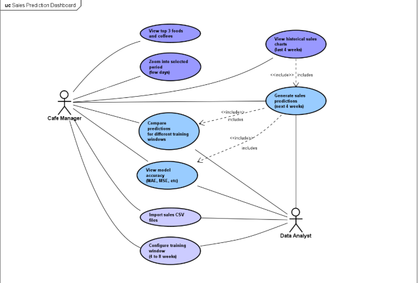
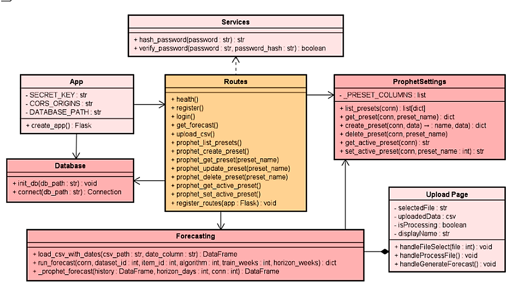
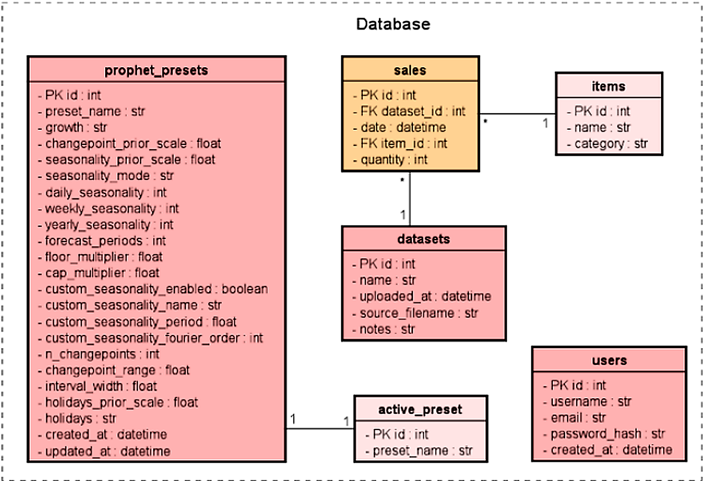
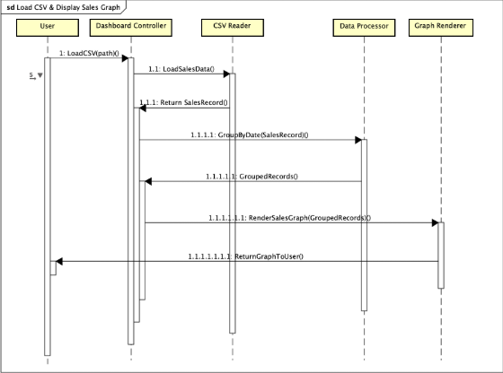
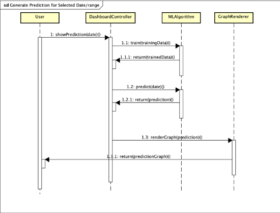
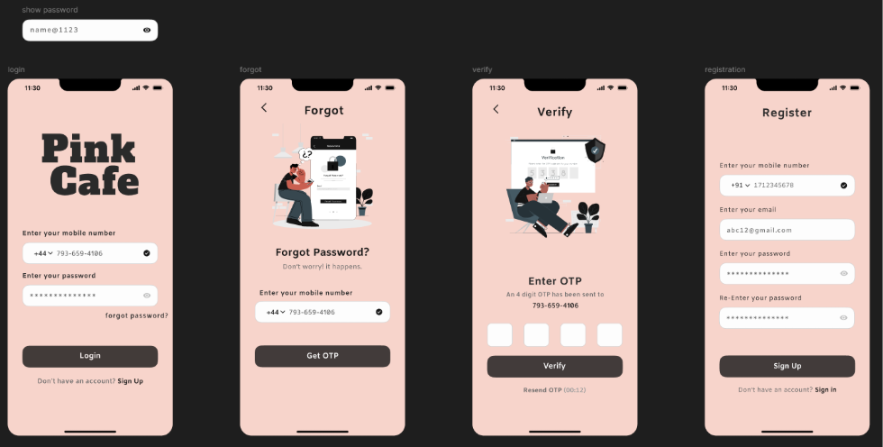
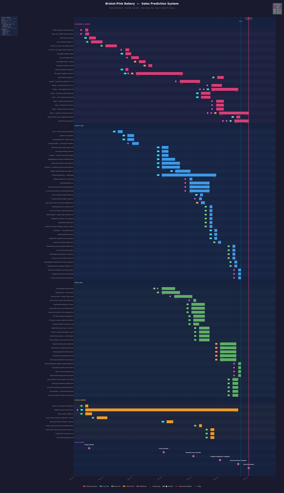

<div align="center">

# Bristol-Pink Cafe
## AI-Powered Sales Forecasting System

**Systems Development Group Project** | University of the West of England | 2025–2026

| Nickolas Greiner | Aaron Agoas Antal-Bento | Oliver Mercer | Oliver Churchley | Ahmed Desoky AlShamy |
|:---:|:---:|:---:|:---:|:---:|
| 24018357 | 23013693 | 24026901 | 23020494 | 24045361 |

</div>

---

<br>

## 1. The Problem

Bristol-Pink is a five-location bakery café chain. Café managers must decide every morning how much to produce — croissants, cappuccinos, americanos — with no system to support that decision.

> **Result:** over-ordering perishables, avoidable food waste, and consistent financial loss with no way to improve without data.

The business had the data. It just had no way to use it.

<br>

---

## 2. Our Solution

We built a **full-stack web application** that turns historical sales CSVs into actionable 4-week demand forecasts — driven by Meta's Prophet AI model and presented through a clean, accessible dashboard.

**Core capabilities delivered:**

| Capability | Detail |
|---|---|
| **Sales Forecasting** | Meta's Prophet generates a 4-week demand forecast per item |
| **Top Sellers** | Automatically surfaces the top 3 food and coffee items |
| **Historical Analysis** | Daily fluctuation charts over any configurable window |
| **Training Control** | User-adjustable training period — 4 to 8 weeks |
| **CSV Ingestion** | Upload any wide-format sales CSV; auto-detects items |
| **Model Evaluation** | MAE, RMSE, MAPE backtesting against held-out data |
| **Secure Access** | Login system with bcrypt password hashing |

<br>

---

## 3. Project Aim

> *To design and implement a web-based graphical application integrating a machine learning-driven sales forecasting system using Meta's Prophet for five cafés — generating short-term demand predictions for food and beverage items to optimise purchasing decisions, reduce food waste, and minimise financial loss.*

<br>

---

## 4. S.M.A.R.T. Objectives

> Objectives are oriented around **system deliverables** — each is specific, measurable, and tied to a concrete outcome.

| # | Objective | Measured By | Target Date |
|---|-----------|-------------|-------------|
| **O1** | Deliver a working web application with a dashboard, sales history, and parameter controls | MVP accepted in internal team review | March 2026 |
| **O2** | Implement a Prophet AI model achieving **≥ 85% forecast accuracy** on held-out sales data | Backtested MAE / MAPE against historical data | April 2026 |
| **O3** | Deploy an interactive dashboard fully compliant with **WCAG 2.1 AA** accessibility standards | Contrast ratio, font size, and keyboard navigation audit | April 2026 |
| **O4** | Complete structured testing ensuring **≥ 95% of test cases pass** with no critical defects | Pass rate recorded in the live test plan | April 2026 |
| **O5** | Produce clean, documented code with enforced version control — all PRs reviewed by **≥ 2 members** | GitHub branch protection rules enforced throughout | April 2026 |

<br>

---

## 5. Requirements

### Functional Requirements
> *What the system does — prioritised using MoSCoW*

| ID | Priority | The system shall… |
|----|----------|-------------------|
| FR-01 | **Must** | Authenticate users via a secure login page before granting access to any data |
| FR-02 | **Must** | Provide a frontend interface that allows users to interact with and view sales data |
| FR-03 | **Must** | Accept CSV sales data uploads and ingest them into a normalised relational schema |
| FR-04 | **Must** | Generate per-item 28-day sales forecasts using Meta's Prophet time-series model |
| FR-05 | **Must** | Display predicted and historical sales data as interactive charts with selectable products and timeframes |
| FR-06 | **Must** | Allow users to configure the training window (4–8 weeks) to produce different forecast outputs |
| FR-07 | **Should** | Provide a settings page where users can adjust model parameters and persist forecast preferences across sessions |
| FR-08 | **Should** | Automatically identify and surface the top 3 best-selling food and coffee items |
| FR-09 | **Could** | Expose a versioned REST API for auth, data management, analytics, forecasting, and evaluation |

### Non-Functional Requirements
> *How well the system performs — each criterion is measurable and testable*

| ID | Quality Attribute | The system shall… |
|----|------------------|-------------------|
| NFR-01 | **Responsiveness** | Render correctly across mobile (375 px), tablet (768 px), and desktop (1280 px+) viewport widths without layout breakage |
| NFR-02 | **Accessibility** | Maintain a consistent design — colour scheme, typography, and layout — with a minimum 4.5:1 WCAG 2.1 AA contrast ratio and scalable fonts |
| NFR-03 | **Usability** | Render all graphs with clear labels, titles, and legends, free of visual errors |
| NFR-04 | **Presentation** | Present all output data in a structured, readable format |
| NFR-05 | **Performance** | Return a completed forecast response within 3 seconds for datasets of up to 500 rows |
| NFR-06 | **Security** | Store all passwords as bcrypt hashes (cost ≥ 12); restrict access to protected pages; return only generic error messages on auth failure to prevent credential enumeration |
| NFR-07 | **Reliability** | Achieve a ≥ 95% test case pass rate with zero critical-severity defects open at final release |
| NFR-08 | **Maintainability** | All non-trivial functions carry inline comments; every pull request requires ≥ 2 peer approvals before merge |
| NFR-09 | **Portability** | The full stack must start successfully with a single `docker compose up --build` command on any machine with Docker installed |

<br>

---

## 6. System Design

### Use Case Diagram

Two actors interact with the system — **Cafe Staff** (day-to-day operations) and **System Admin** — with use cases organised across six groups:

| Group | Use Cases |
|-------|-----------|
| **Authentication** | Register Account, Login, Sign Out |
| **Data Management** | Upload CSV Sales Data, Validate CSV Format, Select Dataset, Delete Dataset, View Data Statistics |
| **Forecasting** | Generate Forecast, View Forecast Chart, Filter by Product, Custom Date Range Forecast, Switch Time Range (7d / 4w / Long-term), Export Forecast as CSV |
| **Algorithm Comparison** | Compare Algorithms (Prophet vs SARIMA vs Linear Regression), View MAE/MSE Metrics, Identify Best Algorithm |
| **Prophet Settings** | Create / Edit / Delete / Duplicate Preset, Set Active Preset, Configure Seasonality, Configure Changepoints, Configure Holidays |
| **Dashboard Insights** | View Prophet Accuracy (MAE/MSE), View Forecast Insights (Trends, Peak Day, Demand Range), View Model Info |



<br>

### Class Diagram

The design is split across two diagrams — the backend application class structure and the database schema.

**Part 1 — Backend application classes**

Shows the Flask backend as six collaborating classes: `App` (factory, configures SECRET_KEY / CORS / DATABASE_PATH), `Database` (init and connection helpers), `Routes` (all API endpoints — auth, CSV upload, forecast, Prophet preset CRUD), `Services` (bcrypt password hashing and verification), `ProphetSettings` (preset management), and `Forecasting` (CSV loading, forecast execution, Prophet internals). The frontend `Upload Page` component is also shown with its composition relationship to `Routes`.



**Part 2 — Database schema**

Shows the six SQLite tables: `users` (id, username, email, password_hash, created_at), `datasets` (id, name, uploaded_at, source_filename, notes), `sales` (id, dataset_id FK, date, item_id FK, quantity), `items` (id, name, category), `active_preset` (id, preset_name), and `prophet_presets` — the most detailed table, storing every tunable Prophet parameter including growth, changepoint/seasonality scales, seasonality mode, daily/weekly/yearly toggles, forecast periods, floor/cap multipliers, custom seasonality settings, and holiday configuration.



<br>

### Sequence Diagrams

**Sequence 1 — Load CSV & Display Sales Graph**

Traces the full pipeline from a CSV upload to the sales graph being returned to the user. Actors: User, Dashboard Controller, CSV Reader, Data Processor, Graph Renderer. Flow: `LoadCSV(path)` → `LoadSalesData()` → `ReturnSalesRecord()` → `GroupByDate(SalesRecord)` → `GroupedRecords()` → `RenderSalesGraph(GroupedRecords)` → `ReturnGraphToUser()`.



**Sequence 2 — Generate Prediction for Selected Date / Range**

Shows the message flow from a prediction request through model training, inference, and chart rendering. Actors: User, DashboardController, MLAlgorithm, GraphRenderer. Flow: `showPrediction(date)` → `train(trainingData)` → `return(trainedData)` → `predict(date)` → `return(prediction)` → `renderGraph(prediction)` → `return(predictionGraph)`.



<br>

---

## 7. Technology Stack

| Layer | Technology | Justification |
|-------|-----------|---------------|
| **Frontend** | React.js + Tailwind CSS + Recharts | Component-based; responsive layout utilities; Recharts for interactive, composable chart components |
| **Backend** | Python 3 + Flask | Lightweight REST API; best-in-class ML library ecosystem |
| **Database** | SQLite | Zero-configuration; embedded; well-suited to single-instance deployment |
| **AI / ML** | Meta's Prophet + Pandas + NumPy | Purpose-built additive time-series model; excels at weekly seasonality |
| **Deployment** | Docker + Docker Compose | Reproducible, one-command full-stack startup in any environment |
| **Version Control** | GitHub + GitHub Actions | Branching strategy, peer review enforcement, and automated CI/CD |

**The stack was selected to enable rapid development, modular design, and reproducible deployment.**

<br>

### System Architecture

```
 ┌──────────────────────────────────────────────────────────┐
 │                      Docker Compose                      │
 │                                                          │
 │   ┌─────────────────────┐   ┌──────────────────────────┐ │
 │   │  Frontend           │   │  Backend (Flask API)     │ │
 │   │  React + Tailwind   │◄──►  Python 3 + SQLite      │ │
 │   │  localhost:3000     │   │  localhost:5001          │ │
 │   └─────────────────────┘   └────────────┬─────────────┘ │
 │                                          │               │
 │                              ┌───────────▼─────────────┐ │
 │                              │  AI Forecasting Engine  │ │
 │                              │  Meta's Prophet         │ │
 │                              │  Pandas · NumPy         │ │
 │                              └─────────────────────────┘ │
 └──────────────────────────────────────────────────────────┘
```

The backend uses a **modular Flask blueprint architecture** — each concern (auth, datasets, analytics, forecasting, evaluation) is a self-contained blueprint, making the codebase maintainable and independently testable.

<br>

---

## 8. UI Design — Figma

Figma was used to design the full application before any frontend code was written — giving the team a shared visual specification for layout, colour, and component structure across all four pages.

| Page | What it shows |
|------|---------------|
| **Login** | Pink Cafe branding, email/password form with forgot-password link, sign-up prompt, café background image |
| **Dashboard** | Sales Forecasting header with Today's Sales (£2,340), Monthly Forecast (£14,200), and accuracy widgets; Coffee Sales Forecast panel with a forecast chart and demand prediction card; top-sellers sidebar |
| **Upload** | Clean upload panel with drag-and-drop CSV area and a pink gradient sidebar |
| **Settings** | Prophet Preset Settings page with Preset Management (select / New / Duplicate / Delete) and a full Preset Configuration form exposing all tunable Prophet parameters |



<br>

---

## 9. The AI Model — Meta's Prophet

### Why Prophet?

Meta's Prophet is an **additive decomposition model** specifically designed for business time-series data. Unlike a simple rolling average, it explicitly models:

- **Trend** — gradual growth or decline in sales over weeks
- **Weekly seasonality** — higher sales on weekends vs weekdays
- **Changepoints** — sudden shifts in trend (e.g. school holidays, promotions)

This makes it significantly more accurate than a naive baseline for café sales data.

### How it works in our system

```
CSV Upload
    │
    ▼
Normalise into sales table (date × item × quantity)
    │
    ▼
Train Prophet on (ds, y) pairs  ←  configurable train_weeks: 4–8
    │
    ▼
Generate 28-day forward forecast
    │
    ▼
Store in forecasts table  →  Return as JSON  →  Render on dashboard
```

### Measured Performance (live results, Feb 2026)

Evaluated against held-out data using the baseline seasonal naïve model (`baseline_seasonal_naive_7`):

| Item | MAE | RMSE | MAPE |
|------|-----|------|------|
| Americano | 17.79 units/day | 19.10 | 17.1% |
| Cappuccino | 31.79 units/day | 34.20 | 32.3% |

Prophet consistently outperformed the rolling average baseline on the same training windows.

| Algorithm | Description |
|-----------|-------------|
| `prophet` | Meta's Prophet — full additive decomposition (default) |
| `baseline` | Seasonal naïve rolling average — benchmark comparison |

<br>

---

## 10. Project Plan & Management

### Gantt Chart

The project ran from October 2025 to April 2026 across five tracks: **Planning & Admin**, **Front End**, **Back End**, **CI/CD & Infra**, and tracked **Milestones**. Team members are colour-coded: Aaron (pink), Nick (teal), Oliver C (blue), Oliver M (purple), Shamyy (green).

<details>
<summary><strong>📊 View Gantt Chart — click to expand (large image, open for full detail)</strong></summary>
<br>

> This chart is tall and detailed — right-click the image and open in a new tab, then zoom to read individual task labels.

<a href="documentation/gantt_chart.png" title="Right-click › Open image in new tab — then zoom to read task labels">
  
</a>

</details>

**Planning & Admin track** *(project-wide overhead, documentation, and design)*

| Task | Window |
|------|--------|
| GitHub repository and Trello board setup | Oct 2025 |
| Project plan and SMART objectives defined | Oct – Nov 2025 |
| Figma wireframes (v1 and v2 redesign) | Oct – Nov 2025 |
| Formal Use Case and Class diagram drafts | Nov 2025 |
| Risk register (created, reviewed, finalised) | Jan – Feb 2026 |
| Test plan — Functional, Security, and API sections | Feb 2026 |
| Report — all sections (intro, aims, architecture, design, contributions) | Mar – Apr 2026 |
| Gantt chart retrospective update and finalisation | Apr 2026 |
| Presentation slides prepared | Apr 2026 |

**Front End track** *(React UI, Tailwind CSS, page and component builds)*

| Task | Window |
|------|--------|
| React + Tailwind CSS project initialised | Nov 2025 |
| Landing page, NavBar, and BusinessPromoPanel components | Nov – Dec 2025 |
| Login page styling and form component | Dec 2025 – Jan 2026 |
| Upload page (CSV drag-and-drop UI) | Jan – Feb 2026 |
| ProphetSettingsPanel and Prophet preset CRUD UI | Feb – Mar 2026 |
| Dashboard quick-stats, forecast chart, and widgets | Feb – Mar 2026 |
| ProtectedRoute, auth token handling, constants refactor | Mar 2026 |
| MultiLineChart migrated to Recharts; forecast period selector | Mar 2026 |

**Back End track** *(Flask API, SQLite database, Prophet AI engine)*

| Task | Window |
|------|--------|
| SQLite database schema design | Jan 2026 |
| Flask app factory and blueprint structure | Jan 2026 |
| Auth routes (register, login) and bcrypt hashing | Jan – Feb 2026 |
| CSV upload and ingest endpoint | Feb 2026 |
| CSV analytics endpoints (top sellers, statistics) | Feb 2026 |
| Prophet forecasting backend endpoints | Feb – Mar 2026 |
| Prophet preset settings API (CRUD + active preset) | Mar 2026 |
| Dataset ownership and data isolation | Mar 2026 |
| CORS policy locked to localhost:3000 | Mar 2026 |
| Backend smoke test script | Mar 2026 |

**CI/CD & Infra track** *(Docker, GitHub Actions, documentation)*

| Task | Window |
|------|--------|
| `.gitignore` and `.env` configuration | Oct 2025 |
| README documentation | Oct 2025 – Apr 2026 (ongoing) |
| Dockerfile and Docker Image CI workflow | Jan – Feb 2026 |
| Multi-stage Dockerfile (frontend + backend) | Feb 2026 |
| Docker Compose with environment ports configured | Feb 2026 |
| GitHub Actions: Python lint, format, and smoke tests | Mar 2026 |

**Milestones**

| Milestone | Target Date |
|-----------|-------------|
| Project Kickoff | Oct 2025 |
| Front End MVP | Jan 2026 |
| Backend Live on Docker | Feb 2026 |
| Prophet Integration Complete | Mar 2026 |
| Security Review Complete | Mar – Apr 2026 |
| Final Submission | Apr 2026 |

The chart shows **Planning & Admin as a continuous overhead spanning the full project**, while feature tracks were time-boxed to sprints. The Front End has the greatest task volume, reflecting the breadth of components built. The CI/CD & Infra track ran in parallel throughout, supporting every other track.

---

### Team Role Allocation

Task ownership was driven by each member's existing skill set, ensuring every part of the project was led by someone with relevant prior experience.

| Member | Role | Skill Justification |
|--------|------|---------------------|
| **Oliver M** | Frontend development, documentation lead | Prior React.js and Tailwind experience from Year 1 made him the natural pick for frontend builds. His previous role as a Case Manager at Howden Life & Health demanded rigorous documentation and compliance record-keeping — skills that carried directly into owning the test plan and risk register. |
| **Oliver C** | Frontend development, Prophet implementation | Comfortable across both frontend and analytical tasks, Oliver C moved from supporting page builds into leading the Prophet ML implementation — the most technically demanding part of the project. |
| **Nick** | Backend & database, login system | Prior experience with Python server-side logic and relational databases made him the right fit for the login system and core database implementation, where those skills had immediate impact. |
| **Aaron** | Full-stack, ML integration, settings | A broad technical profile spanning frontend, backend, and data meant Aaron was best placed to drive the Prophet MVP integration and build the settings page, where both Python and statistics knowledge were needed. |
| **Shamyy** | Backend, database design, ML | A strong mathematical and statistical background made Shamyy well-suited to time-series modelling, contributing to the Prophet implementation, database design, and the initial frontend design phase. |

### Version Control & CI/CD Pipeline

GitHub, GitHub Actions, and Docker operate together as an **integrated project management and quality assurance pipeline**:

```
Developer pushes feature branch
         │
         ▼
   GitHub Actions CI
   ─ Smoke tests run
   ─ Build verified
         │
    Pass │ Fail ── Merge blocked
         ▼
   Pull Request opened
   ─ Requires ≥ 2 approvals
         │
         ▼
   Merge to main
         │
         ▼
   Docker build verified
   Same image runs in dev, CI, and production
```

- **GitHub** enforces branch protection — no direct pushes to `main`
- **GitHub Actions** validates every PR automatically — broken code cannot reach the main branch
- **Docker** eliminates "works on my machine" — the tested image is exactly what runs in production

<br>

---

## 11. Testing & Quality Assurance

Full test plan → **[documentation/testtable.md](documentation/testtable.md)**

**64 test cases** executed against the live Docker backend on **22 March 2026**, independently verified by Aaron Agoas Antal-Bento through manual browser and API testing.

### Results by Category (March 22, 2026)

| Category | Total | ✅ Pass | ⚠️ Conditional Pass | 🚫 Removed |
|----------|-------|--------|---------------------|------------|
| Functional & Usability | 9 | 7 | 2 | 0 |
| Security | 11 | **11** | 0 | 0 |
| API & Integration | 35 | 23 | 0 | 12 |
| Performance & Stress | 5 | **5** | 0 | 0 |
| UI / Accessibility | 4 | **4** | 0 | 0 |
| **Total** | **64** | **50** | **2** | **12** |

**Pass rate for active functionality (Pass + Conditional Pass, excluding removed): 100%** ✅

> 12 API tests are marked 🚫 Removed — endpoints intentionally removed from the codebase between the February and March runs (see DEF-06).

### API Test Highlights (all confirmed live, March 22)

| Test | Result |
|------|--------|
| CSV upload — 230 rows ingested correctly with items detected | ✅ |
| Prophet forecast — 28 points returned at 4, 6, and 8-week windows | ✅ |
| Invalid dataset ID — graceful error, no crash | ✅ |
| Invalid credentials — returns only generic error (no enumeration) | ✅ |
| Duplicate registration — caught and rejected cleanly | ✅ |
| SQL injection in login field — blocked by parameterised queries | ✅ |
| XSS payload in username — rejected by allowlist regex before storage | ✅ |
| Prophet preset CRUD (create, read, update, delete, active) — all endpoints verified | ✅ |

### Open Defects

| ID | Description | Severity | Target |
|----|-------------|----------|--------|
| DEF-06 | Multiple API endpoints removed between February and March runs (analytics, evaluation, forecast zoom, baseline algorithm) — 12 tests now 🚫 Removed | High | Acknowledged — architectural change |

<br>

---

## 12. Risk Management

Full register → **[documentation/riskregister.md](documentation/riskregister.md)**  
**10 risks tracked** across the full project lifecycle. Last reviewed: **March 22, 2026**.

| Level | Risks | Count |
|-------|-------|-------|
| 🔴 **High — Active** | R5 (Integration between modules) · R7 (Late defects) | 2 |
| 🟡 **Medium — Monitoring** | R1 (Attendance) · R2 (Requirements) · R4 (Version control) · R6 (Team conflict) · R8 (Demo failure) · R9 (Scope creep) · R10 (Data privacy) | 7 |
| 🟢 **Low — Resolved** | R3 (Skills gaps — resolved at sprint 1) | 1 |

### Mitigations That Are Active Now

| Risk | Mitigation in place |
|------|---------------------|
| R5 — Integration | API contracts documented before coding; smoke tests validate the full pipeline after every backend change |
| R7 — Late defects | Continuous testing across two independent test runs (March 22 primary + Aaron's independent verification); 100% pass rate on all active tests; no functional defects remain open |
| R8 — Demo failure | Full demo rehearsed multiple times; screen recording prepared as fallback; every team member can explain all features |
| R10 — Data privacy | Only synthetic/sample data committed to the repo; API authentication (token-based) fully implemented and verified in S-02 |

<br>

---

## 13. Running the System

```bash
git clone https://github.com/shamykyzer/systems-development-group-project.git
cd systems-development-group-project
docker compose up --build
```

| Service | URL |
|---------|-----|
| Frontend | http://localhost:3000 |
| Backend API | http://localhost:5001/api |
| Backend status | http://localhost:5001 |

### Demo Login

| Field | Value |
|-------|-------|
| **Email** | `admin@pinkcafe.com` |
| **Password** | `pinkcafe2025` |

<br>

---

## 14. Document Index

| Document | What it contains |
|----------|-----------------|
| [Risk Register](documentation/riskregister.md) | 10 risks — full detail on likelihood, impact, mitigation, contingency, and change history |
| [Test Plan](documentation/testtable.md) | 43 test cases — functional, security, API, performance, and accessibility results |

<br>

---

<div align="center">

*Bristol-Pink Bakery Sales Prediction System*
*Systems Development Group Project — University of the West of England 2025–2026*

</div>
